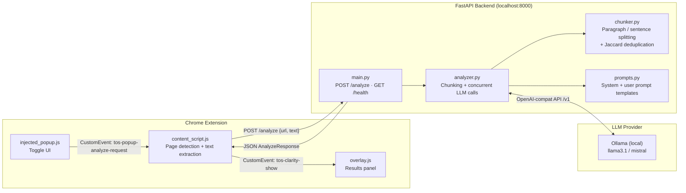

# ToS Clarity

**Never get blindsided by a Terms of Service again.**


ToS Clarity is a Chrome extension that reads Terms of Service and Privacy Policy pages for you and gives you a plain-English breakdown of what you're actually agreeing to — risk scores, hidden clauses, data collection practices, and more. Everything runs on your own machine; your documents never leave your computer.

---

## What It Does

- Automatically detects when you're on a Terms of Service or Privacy Policy page
- Extracts the relevant text and sends it to a local AI model on your machine
- Displays a results panel inside the browser with a full breakdown of the document
- Scores the document on Privacy, Legal, and Lock-in risk (0–10 scale)
- Highlights buried or one-sided clauses in plain English

---

## Quick Start

**You need:** [Ollama](https://ollama.com) installed, Python 3.11+, and Google Chrome.

```bash
# 1. Download an AI model and start Ollama
ollama pull llama3.1
ollama serve

# 2. Start the backend
cd backend
python -m venv venv
venv\Scripts\activate          # Windows
# source venv/bin/activate     # macOS / Linux
pip install -r requirements.txt
python main.py                 # runs on http://127.0.0.1:8000

# 3. Load the extension in Chrome
# Go to chrome://extensions → turn on Developer mode → click "Load unpacked" → select the /extension folder
```

Once loaded, visit any Terms of Service or Privacy Policy page, click the **ToS Clarity** icon in your toolbar, and hit **Review Agreement**.

---

## What You Get

Each analysis returns:

| Field | What it tells you |
|---|---|
| `summary` | One-paragraph description of what the document is |
| `data_collection` | Every type of data the service collects about you |
| `data_sharing` | Third parties your data is shared with |
| `user_rights` | Rights you have — deletion, portability, opt-out |
| `hidden_clauses` | Buried, one-sided, or alarming clauses |
| `risk_scores` | Privacy / Legal / Lock-in scores on a 0–10 scale |
| `plain_english_explanation` | 3–5 sentence plain-language summary |

---

## Configuration

Copy `backend/.env.example` to `backend/.env` and adjust as needed:

| Variable | Default | Description |
|---|---|---|
| `OLLAMA_BASE_URL` | `http://localhost:11434` | Ollama server URL |
| `OLLAMA_MODEL` | `llama3.1` | Model to use (any Ollama-compatible model) |
| `MAX_CHUNK_TOKENS` | `3500` | Max tokens per analysis chunk |
| `BACKEND_PORT` | `8000` | Port the FastAPI server listens on |

---

<details>
<summary><strong>How It Works (technical details)</strong></summary>

### 1. Page detection and text extraction

`content_script.js` runs in Chrome's isolated world and uses a regex pattern + heading scan to detect ToS/Privacy Policy pages. It then walks the DOM with `TreeWalker`, skipping `<nav>`, `<footer>`, `<header>`, cookie banners, and hidden elements, to extract only readable body text. This avoids noise that would waste LLM context.

### 2. Chunking with paragraph-boundary awareness

Large documents are split by `chunker.py` at double-newline paragraph boundaries so that no chunk exceeds the configured token limit (default 3 500 tokens, approximated as `len(text) // 4`). When a single paragraph exceeds the limit, a fallback splitter divides it at sentence-ending punctuation. This guarantees semantic coherence within each chunk.

### 3. Concurrent chunk analysis

`analyzer.py` submits all chunks to the LLM simultaneously using `asyncio.gather()`. Analysis latency is therefore constant regardless of document length — a 10-chunk document takes the same wall-clock time as a 1-chunk document, limited only by the LLM's throughput.

### 4. Near-duplicate deduplication

When results from multiple chunks are merged, `deduplicate_list()` removes near-duplicate findings using **Jaccard token overlap** with an 82 % threshold. This avoids requiring an embedding model while still catching paraphrased duplicates — e.g. *"collects your email address"* and *"email address is collected"* collapse into one entry.

### 5. Conservative risk score merging

Risk scores across chunks are merged by taking the **maximum**, not the average. A single high-risk clause is enough to flag a document; averaging would mask it.

### 6. Temperature 0.1 for deterministic legal analysis

All LLM calls use `temperature=0.1`. Legal analysis requires precision and consistency — low temperature suppresses hallucination and produces near-identical outputs for the same input, which is critical when the same document is analyzed in multiple chunks.

### 7. Dual-world Chrome extension architecture

Chrome MV3 extensions run content scripts in an `ISOLATED` world and injected scripts in the `MAIN` world (same JS context as the page). `background.js` injects `overlay.js` into the MAIN world so it can manipulate the page DOM freely, while `content_script.js` stays in the ISOLATED world to safely access `chrome.*` APIs. The two communicate via `CustomEvent` on the shared `document` object.

</details>

<details>
<summary><strong>Architecture Diagram</strong></summary>



</details>

---

## Project Structure

```
quant_project/
├── backend/
│   ├── main.py            # FastAPI server — /analyze, /health
│   ├── analyzer.py        # LLM orchestration, chunking, result merging
│   ├── chunker.py         # Text splitting + Jaccard deduplication
│   ├── models.py          # Pydantic request/response schemas
│   ├── prompts.py         # System + user prompt templates
│   ├── requirements.txt
│   ├── requirements-dev.txt
│   └── tests/
│       ├── conftest.py
│       ├── test_chunker.py
│       ├── test_models.py
│       └── test_analyzer.py
└── extension/
    ├── manifest.json      # Chrome MV3 manifest
    ├── background.js      # Service worker — injects scripts on icon click
    ├── content_script.js  # Page detection, text extraction, API bridge
    ├── injected_popup.js  # Floating toggle panel (MAIN world)
    └── overlay.js         # Full results overlay (MAIN world)
```

---

## Running Tests

```bash
cd backend
pip install -r requirements-dev.txt
pytest tests/ -v
```

---

## License

MIT
