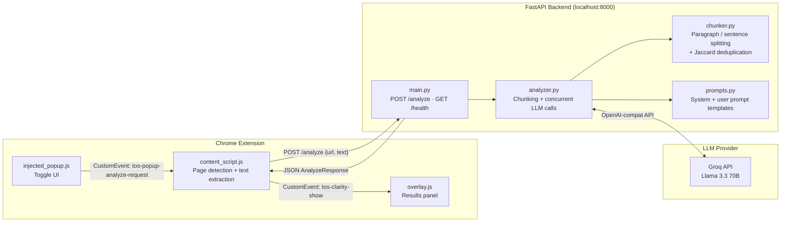

# ToS Clarity

**Never get blindsided by a Terms of Service again.**


ToS Clarity is a Chrome extension that reads Terms of Service and Privacy Policy pages for you and gives you a plain-English breakdown of what you're actually agreeing to — risk scores, hidden clauses, data collection practices, and more. Document text is analyzed by Llama 3.3 70B via the [Groq API](https://groq.com).

---

## What It Does

- Automatically detects when you're on a Terms of Service or Privacy Policy page
- Extracts the relevant text and sends it to a local backend for analysis
- Displays a results panel inside the browser with a full breakdown of the document
- Scores the document on Privacy, Legal, and Lock-in risk (0–10 scale)
- Highlights buried or one-sided clauses in plain English
- Shows a setup screen if the backend isn't running, with a Retry button
- Lets you configure the backend URL via the extension's Settings page

---

## Quick Start

**You need:** A [Groq API key](https://console.groq.com/keys) (free), Python 3.11+, and Google Chrome.

### 1. Set up the backend

```bash
cd backend
python -m venv venv
venv\Scripts\activate          # Windows
# source venv/bin/activate     # macOS / Linux
pip install -r requirements.txt
```

Copy the example env file and add your Groq API key:

```bash
copy .env.example .env        # Windows
# cp .env.example .env        # macOS / Linux
```

Open `backend/.env` and fill in your key:

```
GROQ_API_KEY=your_groq_api_key_here
GROQ_MODEL=llama-3.3-70b-versatile
MAX_CHUNK_TOKENS=3500
BACKEND_PORT=8000
```

Start the server:

```bash
uvicorn main:app --reload
```

The backend runs on `http://127.0.0.1:8000`. Verify it's working:
```
http://127.0.0.1:8000/health
```
You should see: `{"status":"ok","model":"llama-3.3-70b-versatile","version":"1.0.0"}`

### 2. Load the extension in Chrome

1. Go to `chrome://extensions`
2. Enable **Developer mode** (top-right toggle)
3. Click **Load unpacked**
4. Select the `/extension` folder from this project

### 3. Use it

Visit any Terms of Service or Privacy Policy page, click the **TC** icon in your toolbar, and hit **Review Agreement**. Results appear in a panel on the right side of the page in about 2–5 seconds.

---

## What You Get

Each analysis returns:

| Field | What it tells you |
|---|---|
| `summary` | One-paragraph description of what the document is |
| `data_collection` | Every type of data the service collects about you |
| `data_sharing` | Third parties your data is shared with |
| `user_rights` | Rights you have — deletion, portability, opt-out |
| `hidden_clauses` | Buried, one-sided, or alarming clauses |
| `risk_scores` | Privacy / Legal / Lock-in scores on a 0–10 scale |
| `plain_english_explanation` | 3–5 sentence plain-language summary |

---

## Configuration

Edit `backend/.env`:

| Variable | Default | Description |
|---|---|---|
| `GROQ_API_KEY` | *(required)* | Your Groq API key from console.groq.com |
| `GROQ_MODEL` | `llama-3.3-70b-versatile` | Any Groq-supported model |
| `MAX_CHUNK_TOKENS` | `3500` | Max tokens per analysis chunk |
| `BACKEND_PORT` | `8000` | Port the FastAPI server listens on |

To change the backend URL from inside the extension (e.g. different port), go to `chrome://extensions` → **ToS Clarity** → **Details** → **Extension options**.

---

## Troubleshooting

**Popup shows "Backend not running"**
- Make sure the backend server is running (`uvicorn main:app --reload`)
- Click **Retry Connection** in the popup

**Analysis error: 429 / quota exceeded**
- Your Groq key has hit its rate limit — wait a minute and try again
- Free tier allows 30 requests/min and 14,400 requests/day

**"No legal content detected"**
- The extension ran on a page without ToS/legal text
- Try an actual Terms of Service URL (e.g. `https://policies.google.com/terms`)

**Extension not responding after installing**
- Reload the page — content scripts only inject on pages loaded after the extension is installed
- If still stuck, go to `chrome://extensions` and click the refresh icon on ToS Clarity

**Analysis takes too long or times out**
- Large documents are chunked and analyzed concurrently — very long documents (500K+ characters) are capped and a note is appended to results

---

<details>
<summary><strong>How It Works (technical details)</strong></summary>

### 1. Page detection and text extraction

`content_script.js` runs in Chrome's isolated world and uses a regex pattern + heading scan to detect ToS/Privacy Policy pages. It then walks the DOM with `TreeWalker`, skipping `<nav>`, `<footer>`, `<header>`, cookie banners, and hidden elements, to extract only readable body text. This avoids noise that would waste LLM context.

### 2. Chunking with paragraph-boundary awareness

Large documents are split by `chunker.py` at double-newline paragraph boundaries so that no chunk exceeds the configured token limit (default 3,500 tokens, approximated as `len(text) // 4`). When a single paragraph exceeds the limit, a fallback splitter divides it at sentence-ending punctuation. This guarantees semantic coherence within each chunk.

### 3. Concurrent chunk analysis

`analyzer.py` submits all chunks to the LLM simultaneously using `asyncio.gather()`. Analysis latency is therefore constant regardless of document length — a 10-chunk document takes the same wall-clock time as a 1-chunk document, limited only by the LLM's throughput.

### 4. Near-duplicate deduplication

When results from multiple chunks are merged, `deduplicate_list()` removes near-duplicate findings using **Jaccard token overlap** with an 82% threshold. This avoids requiring an embedding model while still catching paraphrased duplicates — e.g. *"collects your email address"* and *"email address is collected"* collapse into one entry.

### 5. Conservative risk score merging

Risk scores across chunks are merged by taking the **maximum**, not the average. A single high-risk clause is enough to flag a document; averaging would mask it.

### 6. Temperature 0.1 for deterministic legal analysis

All LLM calls use `temperature=0.1`. Legal analysis requires precision and consistency — low temperature suppresses hallucination and produces near-identical outputs for the same input, which is critical when the same document is analyzed in multiple chunks.

### 7. Dual-world Chrome extension architecture

Chrome MV3 extensions run content scripts in an `ISOLATED` world and injected scripts in the `MAIN` world (same JS context as the page). `background.js` injects `overlay.js` into the MAIN world so it can manipulate the page DOM freely, while `content_script.js` stays in the ISOLATED world to safely access `chrome.*` APIs. The two communicate via `CustomEvent` on the shared `document` object.

### 8. Backend URL configurability

The backend URL defaults to `http://127.0.0.1:8000` but is stored in `chrome.storage.sync` and can be changed via the extension's options page — useful if you run the backend on a different port.

</details>

<details>
<summary><strong>Architecture Diagram</strong></summary>



</details>

---

## Project Structure

```
quant_project/
├── backend/
│   ├── main.py            # FastAPI server — /analyze, /health, rate limiting
│   ├── analyzer.py        # LLM orchestration, chunking, result merging
│   ├── chunker.py         # Text splitting + Jaccard deduplication
│   ├── models.py          # Pydantic request/response schemas
│   ├── prompts.py         # System + user prompt templates
│   ├── requirements.txt
│   ├── requirements-dev.txt
│   ├── .env.example       # Copy to .env and add your Groq key
│   └── tests/
│       ├── conftest.py
│       ├── test_chunker.py
│       ├── test_models.py
│       └── test_analyzer.py
└── extension/
    ├── manifest.json      # Chrome MV3 manifest (v1.1.0)
    ├── background.js      # Service worker — injects scripts on icon click
    ├── content_script.js  # Page detection, text extraction, API bridge
    ├── popup.html/js      # Toolbar popup with health check + onboarding
    ├── injected_popup.js  # Floating toggle panel (MAIN world)
    ├── overlay.js/css     # Full results overlay (MAIN world)
    ├── options.html/js    # Settings page — configure backend URL
    └── privacy_policy.html
```

---

## Running Tests

```bash
cd backend
pip install -r requirements-dev.txt
pytest tests/ -v
```

---

## Privacy

Document text is sent to the [Groq API](https://groq.com) for analysis. No data is stored by this extension. See [extension/privacy_policy.html](extension/privacy_policy.html) for full details.

---

## License

MIT
