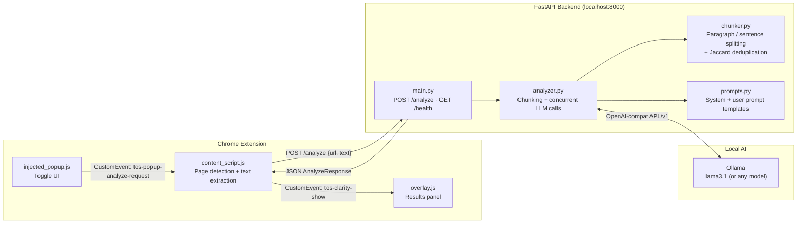

# ToS Clarity

**Never get blindsided by a Terms of Service again.**


ToS Clarity is a Chrome extension that reads Terms of Service and Privacy Policy pages for you and gives you a plain-English breakdown of what you're actually agreeing to — risk scores, hidden clauses, data collection practices, and more. Everything runs on your own machine. Your documents never leave your device.

---

## What It Does

- Automatically detects when you're on a Terms of Service or Privacy Policy page
- Extracts the relevant text and sends it to a local AI model running on your machine
- Displays a results panel inside the browser with a full breakdown of the document
- Scores the document on Privacy, Legal, and Lock-in risk (0-10 scale)
- Highlights buried or one-sided clauses in plain English
- Shows a setup screen if the backend isn't running, with a Retry button
- Lets you configure the backend URL via the extension's Settings page

---

## Quick Start

**You need:** [Ollama](https://ollama.com) installed, Python 3.11+, and Google Chrome.

### 1. Pull a model and start Ollama

```bash
ollama pull llama3.1
ollama serve
```

### 2. Set up the backend

```bash
cd backend
python -m venv venv
venv\Scripts\activate        # Windows
# source venv/bin/activate   # macOS / Linux
pip install -r requirements.txt
```

Copy the example env file:

```bash
copy .env.example .env       # Windows
# cp .env.example .env       # macOS / Linux
```

Start the server:

```bash
uvicorn main:app --reload
```

Verify it's working by visiting `http://127.0.0.1:8000/health` — you should see:
```json
{"status": "ok", "model": "llama3.1", "version": "1.0.0"}
```

### 3. Load the extension in Chrome

1. Go to `chrome://extensions`
2. Enable **Developer mode** (top-right toggle)
3. Click **Load unpacked**
4. Select the `/extension` folder from this project

### 4. Use it

Visit any Terms of Service or Privacy Policy page, click the **TC** icon in your toolbar, and hit **Review Agreement**. Results appear in a panel on the right side of the page.

---

## What You Get

Each analysis returns:

| Field | What it tells you |
|---|---|
| `summary` | One-paragraph description of what the document is |
| `data_collection` | Every type of data the service collects about you |
| `data_sharing` | Third parties your data is shared with |
| `user_rights` | Rights you have — deletion, portability, opt-out |
| `hidden_clauses` | Buried, one-sided, or alarming clauses |
| `risk_scores` | Privacy / Legal / Lock-in scores on a 0-10 scale |
| `plain_english_explanation` | 3-5 sentence plain-language summary |

---

## Configuration

Edit `backend/.env`:

| Variable | Default | Description |
|---|---|---|
| `OLLAMA_BASE_URL` | `http://localhost:11434` | Ollama server URL |
| `OLLAMA_MODEL` | `llama3.1` | Any Ollama-compatible model |
| `MAX_CHUNK_TOKENS` | `3500` | Max tokens per analysis chunk |
| `BACKEND_PORT` | `8000` | Port the FastAPI server listens on |

To change the backend URL from inside the extension (e.g. different port), go to `chrome://extensions` → ToS Clarity → Details → Extension options.

---

## Troubleshooting

**Popup shows "Backend not running"**
- Make sure Ollama is running (`ollama serve`)
- Make sure the backend server is running (`uvicorn main:app --reload`)
- Click **Retry Connection** in the popup

**Analysis takes a long time**
- This depends on your hardware. On a GPU it takes a few seconds; on CPU it can take 1-2 minutes
- Large documents are chunked and analyzed concurrently, so very long documents don't take proportionally longer

**"No legal content detected"**
- The extension ran on a page without ToS/legal text
- Try an actual Terms of Service URL (e.g. `https://policies.google.com/terms`)

**Extension not responding after installing**
- Reload the page — content scripts only inject on pages loaded after the extension is installed
- If still stuck, go to `chrome://extensions` and click the refresh icon on ToS Clarity

---

<details>
<summary><strong>How It Works (technical details)</strong></summary>

### 1. Page detection and text extraction

`content_script.js` runs in Chrome's isolated world and uses a regex pattern + heading scan to detect ToS/Privacy Policy pages. It then walks the DOM with `TreeWalker`, skipping `<nav>`, `<footer>`, `<header>`, cookie banners, and hidden elements, to extract only readable body text.

### 2. Chunking with paragraph-boundary awareness

Large documents are split by `chunker.py` at double-newline paragraph boundaries so that no chunk exceeds the configured token limit (default 3,500 tokens, approximated as `len(text) // 4`). When a single paragraph exceeds the limit, a fallback splitter divides it at sentence-ending punctuation.

### 3. Concurrent chunk analysis

`analyzer.py` submits all chunks to the LLM simultaneously using `asyncio.gather()`. Analysis latency is constant regardless of document length — a 10-chunk document takes the same wall-clock time as a 1-chunk document.

### 4. Near-duplicate deduplication

When results from multiple chunks are merged, `deduplicate_list()` removes near-duplicate findings using Jaccard token overlap with an 82% threshold. This avoids requiring an embedding model while still catching paraphrased duplicates.

### 5. Conservative risk score merging

Risk scores across chunks are merged by taking the maximum, not the average. A single high-risk clause is enough to flag a document.

### 6. Temperature 0.1 for deterministic legal analysis

All LLM calls use `temperature=0.1`. Low temperature suppresses hallucination and produces consistent outputs for the same input.

### 7. Dual-world Chrome extension architecture

Chrome MV3 content scripts run in an `ISOLATED` world while injected scripts run in the `MAIN` world (same JS context as the page). `background.js` injects `overlay.js` into the MAIN world so it can manipulate the page DOM freely, while `content_script.js` stays in the ISOLATED world to safely access `chrome.*` APIs. The two communicate via `CustomEvent` on the shared `document` object.

### 8. Trusted Types compatibility

All DOM manipulation uses `createElement`, `textContent`, and `appendChild` instead of `innerHTML`, making the extension compatible with pages that enforce Trusted Types security policies (such as Google pages).

</details>

<details>
<summary><strong>Architecture Diagram</strong></summary>



</details>

---

## Project Structure

```
quant_project/
├── backend/
│   ├── main.py            # FastAPI server — /analyze, /health, rate limiting
│   ├── analyzer.py        # LLM orchestration, chunking, result merging
│   ├── chunker.py         # Text splitting + Jaccard deduplication
│   ├── models.py          # Pydantic request/response schemas
│   ├── prompts.py         # System + user prompt templates
│   ├── requirements.txt
│   ├── requirements-dev.txt
│   ├── .env.example       # Copy to .env and configure
│   └── tests/
│       ├── conftest.py
│       ├── test_chunker.py
│       ├── test_models.py
│       └── test_analyzer.py
└── extension/
    ├── manifest.json      # Chrome MV3 manifest (v1.1.0)
    ├── background.js      # Service worker — injects scripts on icon click
    ├── content_script.js  # Page detection, text extraction, API bridge
    ├── popup.html/js      # Toolbar popup with health check and onboarding
    ├── injected_popup.js  # Floating toggle panel (MAIN world)
    ├── overlay.js/css     # Full results overlay (MAIN world)
    ├── options.html/js    # Settings page — configure backend URL
    └── privacy_policy.html
```

---

## Running Tests

```bash
cd backend
pip install -r requirements-dev.txt
pytest tests/ -v
```

---

## Privacy

Everything runs locally on your machine. The extension talks to your local backend, which talks to your local Ollama instance. No data is sent anywhere outside your own device. See [extension/privacy_policy.html](extension/privacy_policy.html) for full details.

---

## License

MIT
